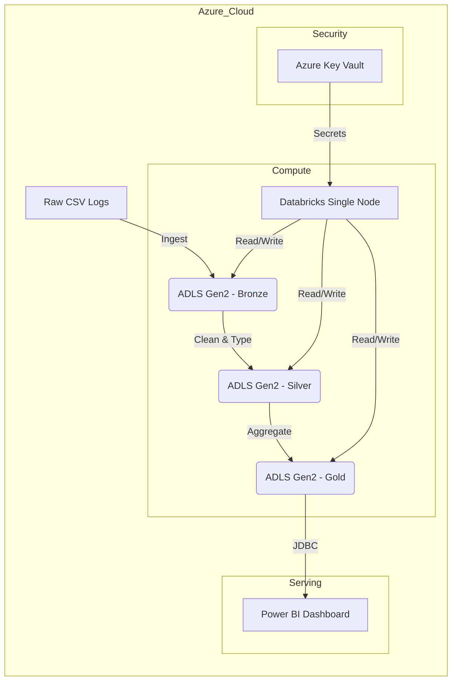
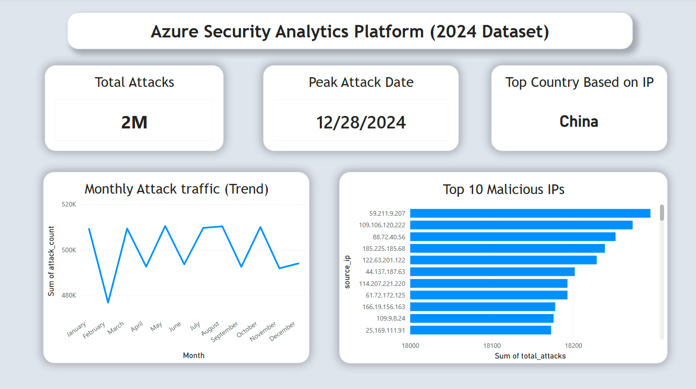

Here is a professional, portfolio-ready `README.md` file for your project.

You can copy and paste this directly into your GitHub repository. I have included a **Mermaid diagram** for the architecture, which GitHub renders automatically.

---

# Azure Security Log Analytics Platform 🛡️

An end-to-end **Security Operations Center (SOC)** data engineering project that ingests, processes, and visualizes cybersecurity threat logs. This project demonstrates a **Lakehouse Architecture** built entirely with **Infrastructure as Code (IaC)**.

---

## 🏗️ Architecture

The pipeline follows the **Medallion Architecture** (Bronze  Silver  Gold) to transform raw logs into actionable intelligence.



## 🚀 Key Features

* **Infrastructure as Code (IaC):** The entire Azure environment (Resource Group, Storage Account, Databricks Workspace, Key Vault) is provisioned using **Terraform**, ensuring zero configuration drift.
* **Secure Credential Management:** No hardcoded secrets. Utilizes **Azure Key Vault** backed Secret Scopes in Databricks to manage storage access keys securely.
* **Medallion Architecture:**
* **Bronze:** Raw ingestion of security logs.
* **Silver:** Cleaned data with correct schema (Timestamp casting, snake_case renaming) stored as **Delta Tables**.
* **Gold:** Aggregated business metrics (Attacks per hour, Top malicious IPs).


* **Automated Workflows:** Orchestrated ETL pipeline using **Databricks Workflows (Jobs)** with dependency management.
* **Cost Optimization:** Configured a Single-Node Databricks cluster policy and auto-termination to mimic a cost-effective production environment.

## 🛠️ Tech Stack

* **Cloud Provider:** Microsoft Azure
* **Infrastructure:** Terraform
* **Processing:** Apache Spark (PySpark) on Azure Databricks
* **Storage:** Azure Data Lake Storage Gen2 (ADLS) & Delta Lake
* **Orchestration:** Databricks Workflows
* **Visualization:** Power BI Desktop

## 📂 Repository Structure

```bash
.
├── dataset/                  # Dataset files
├── terraform/                  # Terraform configuration files
│   ├── main.tf             # Provider setup
│   ├── compute.tf          # Databricks Workspace & Cluster
│   ├── security.tf         # Key Vault & Access Policies
│   └── jobs.tf             # Databricks Workflow definitions
├── notebooks/              # ETL Logic (PySpark)
│   ├── 00_Common_Config    # Global setup & Secret retrieval
│   ├── 02_Bronze_Ingestion # Raw data load
│   ├── 03_Silver_Transformation   # Transformations & Schema enforcement
│   └── 04_Gold_Analytics   # Business logic aggregations
├── proofs/                 # Proof of concept files
├── README.md

```

## ⚙️ Getting Started

### Prerequisites

* Azure Subscription (Free Tier works)
* Terraform CLI installed
* Azure CLI (`az login`)

### 1. Provision Infrastructure

Run the Terraform script to create the environment.

```bash
cd terraform
terraform init
terraform apply

```

*Type `yes` to confirm. This will create the Resource Group, Storage, Databricks Workspace, and Key Vault.*

### 2. Configure Databricks

1. Navigate to the newly created Databricks Workspace.
2. Import the notebooks from the `notebooks/` folder into your Workspace.
3. Ensure the **Secret Scope** `security-secrets` is linked correctly (Terraform handles the Key Vault creation, but verify permissions).

### 3. Run the Pipeline

Trigger the **"Security-Log-ETL-Pipeline"** in Databricks Workflows.

* **Job 1:** Ingests raw CSV data into `bronze`.
* **Job 2:** Cleanses data to `silver` Delta tables.
* **Job 3:** Aggregates metrics to `gold` Delta tables.

### 4. Visualize

Connect Power BI to the Databricks `Gold` tables using the **Azure Databricks Connector** (JDBC) to view the threat dashboard.

## 📊 Dashboard Preview



**Insights Delivered:**

* Peak attack traffic times (Time-series analysis).
* Top 10 Source IPs by attack volume.
* Geographic distribution of threats.

## 🧹 Cleanup

To avoid Azure costs, destroy all resources when finished:

```bash
terraform destroy

```

## 👨‍💻 Author

**Hariprasad Bathini Sankaran**

* [LinkedIn] https://www.linkedin.com/in/hariprasadbs/
* [Portfolio] https://hariprasad-b-s.github.io/portfolio/

---

*Built as a capstone project for Data Engineering with Azure.*